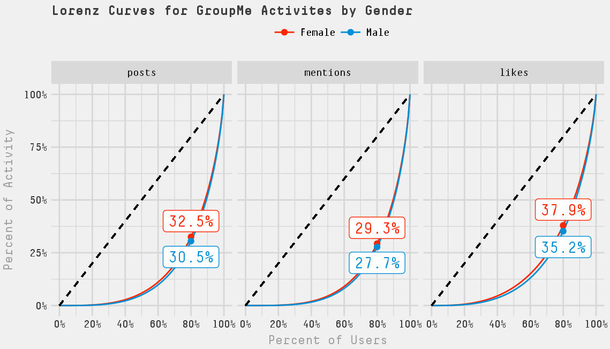

# MKTG776 Project 1
Applying NBD count models to examine the behavior of Wharton MBA students on the messaging platform GroupMe

# Executive Summary
In this paper we use NBD count models to examine the behavior of Wharton MBA students on the messaging platform GroupMe. With data from the Wharton 2018 GroupMe, in which nearly all class members are users, we fit NBD models to the activities of posting a message, being mentioned in a message, and liking a message. In the observation period we find that **users post approximately 5 times more than they are mentioned and like posts 5 times more than they post**. Moreover, we find that being mentioned is the most concentrated (small number of students account for most mentions) while liking messages is the least concentrated. Finally, we built NBD models for each gender but find that **behaviors for females and males are the same** in the Wharton 2018 GroupMe.
